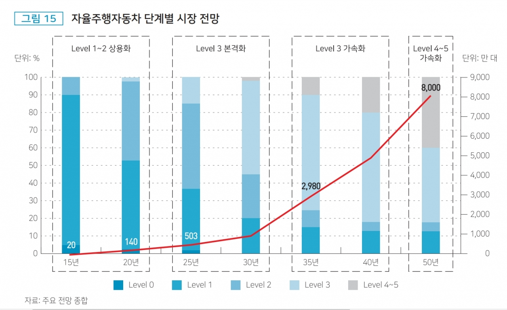
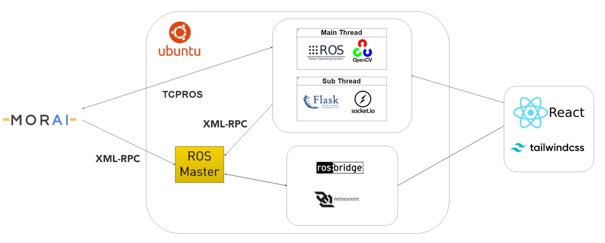
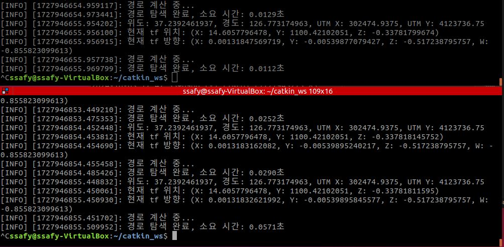
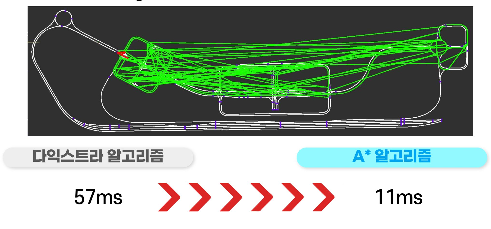
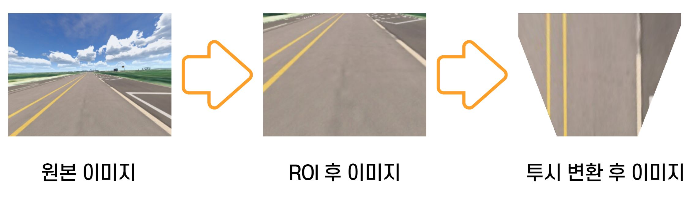
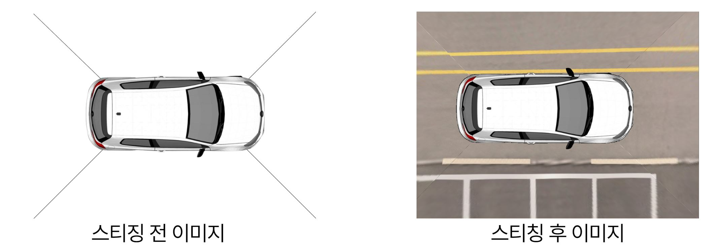
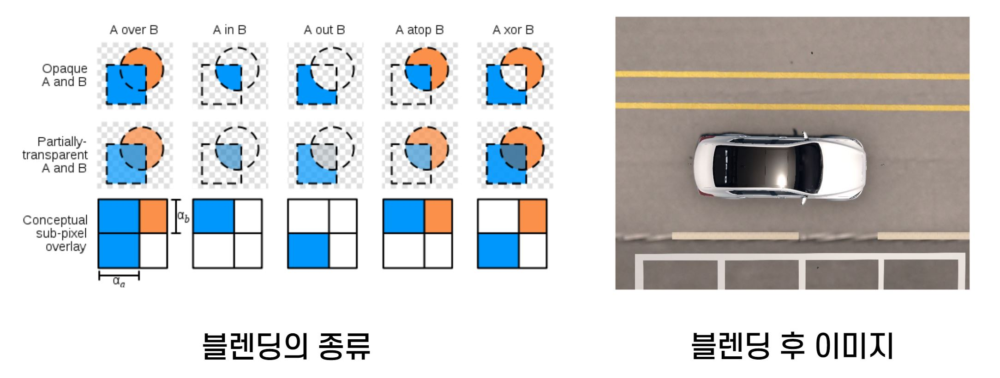
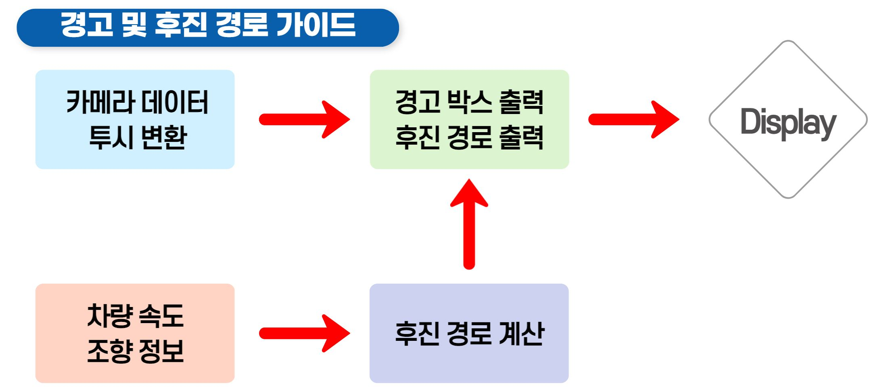
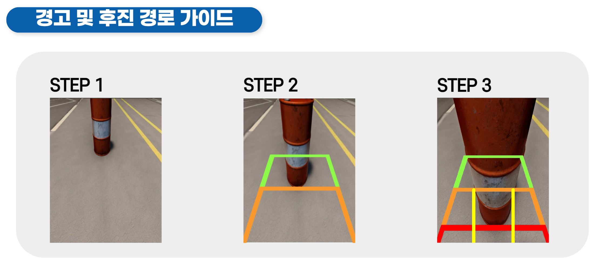
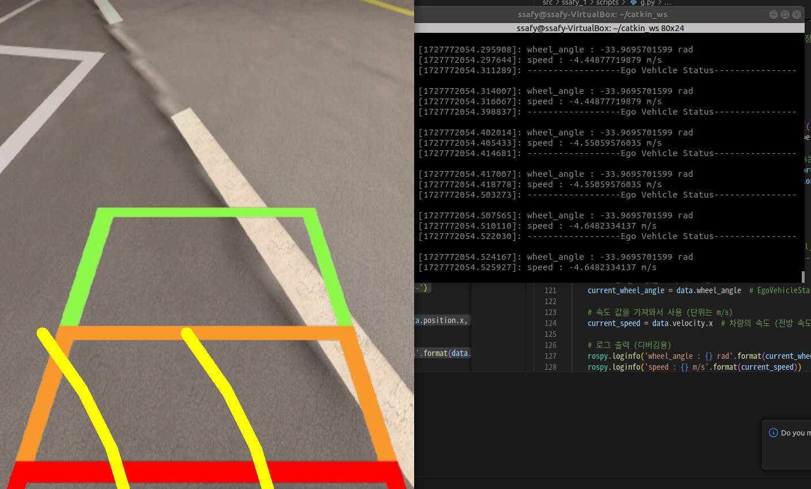

<table align="center">
<tr>
<td align="center">

</a>
</td>
</tr>
</table>
 

## Index
#### &emsp; [➤ 프로젝트 소개](#-프로젝트-소개) 
#### &emsp; [➤ 프로젝트 설계](#-프로젝트-설계) 
#### &emsp; [➤ 기능 소개](#-기능-소개) 
#### &emsp; [➤ 산출물](#-산출물) 
 

# 🚔 프로젝트 소개

## ADAS와 자율주행을 탑재한 스마트 주행 솔루션
1. 주행 경로 설정 (최소 거리, 최소 비용, 어린이 보호구역 회피)
2. 자율주행
3. 어라운드 뷰
4. 후방 카메라

 

## 프로젝트 기간

| 프로젝트 기간 | 2024.08.19 ~ 2024.10.11 (7주) |
|---|---|
 

## 팀 소개
<table>
  <thead>
    <tr>
      <th style="text-align: center;">윤의웅</th>
      <th style="text-align: center;">박건국</th>
      <th style="text-align: center;">정우영</th>
      <th style="text-align: center;">조정훈</th>
    </tr>
  </thead>
  <tbody>
    <tr>
      <td style="text-align: center;">어라운드 뷰 후방카메라</td>
      <td style="text-align: center;">경로 생성 경로-자율주행 통합
      </td>
      <td style="text-align: center;">ROS-Web 통신 시스템 통합
      </td>
      <td style="text-align: center;">자율주행 제어 경로 시각화</td>
    </tr>
  </tbody>
</table>
 

## 기획 배경

자율주행 기술은 빠르게 발전하고 있지만, 아직 상용화를 위해서는 다양한 주행 환경에서의 철저한 테스트와 검증이 필요합니다. 
  그러나 실제 도로에서 테스트를 진행하는 것은 비용이 많이 들고 위험성이 크기 때문에, MORAI SIM과 같은 시뮬레이션을 통해 다양한 시나리오를 안전하고 효율적으로 검증할 수 있는 필요성이 대두되고 있습니다. 
  시뮬레이션 환경에서는 복잡한 도로 상황을 반복적으로 실험할 수 있으며, 위험한 상황도 안전하게 재현할 수 있다는 장점이 있습니다. 또한, ADAS를 탑재한 자율주행 기술은 운전자의 편의와 안전성을 극대화하는 핵심 요소로, 실제 차량에 적용하기 전 철저한 시뮬레이션을 통해 성능을 최적화하고 있습니다.

  
 

# 🚔 프로젝트 설계
## 개발 환경

<h3>OS</h3>

<h3>MiddleWare</h3>

<h3>Simulator</h3>

<h3>Embedded</h3>
 

<h3>Server</h3>

<h3>Frontend</h3>

<h3>협업 툴</h3>

 
  
 

## 시스템 아키텍처

 

# 🚔 기능 소개

### 1. 주행 경로 설정 (최소 거리, 최소 비용, 어린이 보호구역 회피)

<b>1.1 A*알고리즘</b>

- 기존 다익스트라 알고리즘에서 A* 알고리즘을 활용한 주행 경로 탐색 시간 80% 단축

### 2. 자율주행

### 자율주행 로직

- 경로 생성 + 장애물 정보 -> 차량 제어

<b>2.1 장애물 회피

2.2 PID 제어

2.3 곡률 기반 제어

### 3. 어라운드 뷰

</b>

- 카메라 배치
- 캘리브레이션 및 보정
- 이미지 변환
- 이미지 스티칭
- 경계 영역 및 블랜딩

<b>

3.1 광각 카메라 배치

3.2 캘리브레이션 및 보정

3.3 이미지 변환

3.4 이미지 스티칭

3.5 경계 영역 및 블랜딩

    
### 4. 후방 카메라

4.1 전체 로직 

4.2 속도 및 조향 정보 기반 경로 추출

  

---

### 커밋 컨벤션
- feat : 새로운 기능 추가
- fix : 버그 수정
- hotfix : 급하게 치명적인 버그 수정
- docs : 문서 수정
- style : 코드 포맷팅, 세미콜론 등의 스타일 수정(코드 자체 수정 X)
- refactor : 프로덕션 코드 리팩토링
- test : 테스트 코드, 테스트 코드 리팩토링
- chore : 빌드 과정 또는 보조 기능(문서 생성 기능 등) 수정
- rename : 파일 혹은 폴더명을 수정하거나 옮기는 작업만인 경우
- remove : 파일을 삭제하는 작업만 수행한 경우
- comment : 필요한 주석 추가 및 변경

